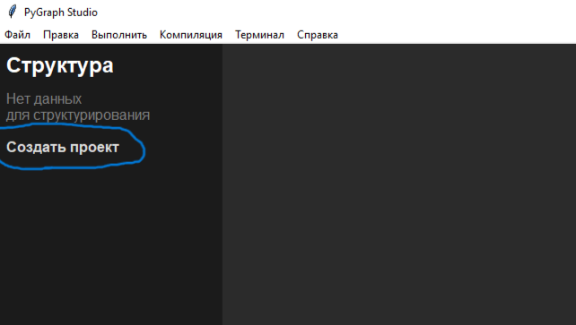
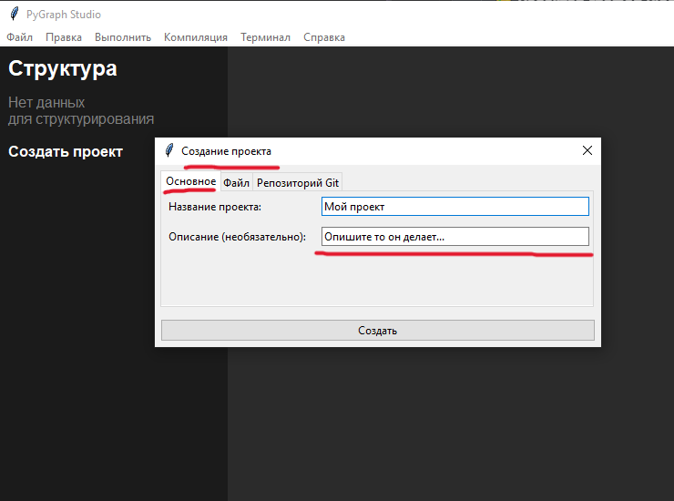
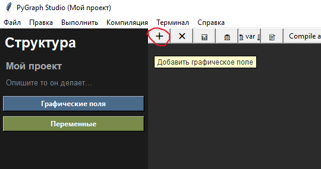
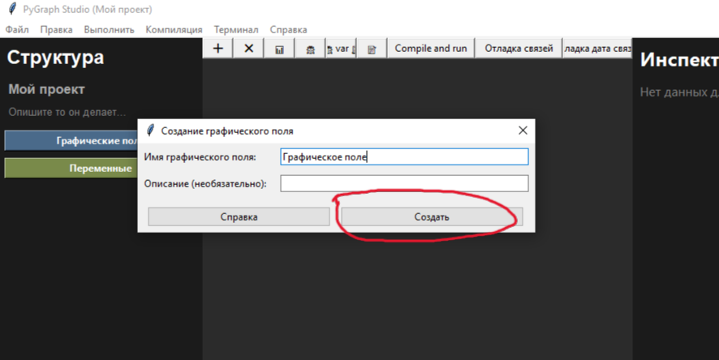
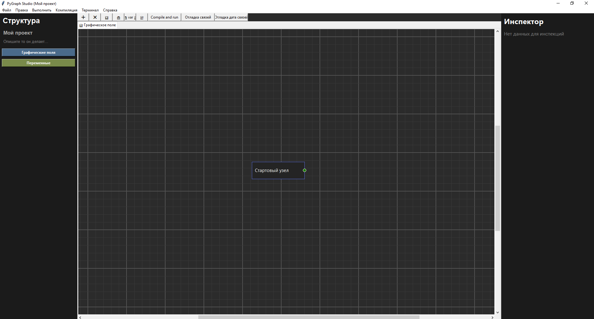

# PyGraph Studio

**Редактор для визуального программирования Python кода**
## 📚 Оглавление

- [О проекте](#-о-проекте)
- [Документация](#-документация)
- [Для кого этот проект?](#подходит-для)
- [Возможности](#-возможности)
- [Быстрый старт (как создать графу)](#-быстрый-старт)

## 📌 О проекте

PyGraph Studio - это инструмент визуального программирования для Python. Вместо написания кода строка за строкой вы создаёте логику с помощью узлов и связей, а программа генерирует чистый Python код.

## 📚 Документация

| Документ | Описание |
|----------|----------|
| [Установка](docs/INSTALL.md) | Как установить и запустить |

## Подходит для:

| Аудитория | Зачем?  |
|-----------|-------|
| 🎓 **Новички** | Учитесь логике, не отвлекаясь на синтаксис |
| 👨‍💻 **Профессионалы** | Быстрое прототипирование и визуализация архитектуры |
| 🧑‍🏫 **Преподаватели** | Наглядное объяснение алгоритмов |
| 🚀 **Программисты** | Кому хочется попробовать новое в мире Python |

## ✨ Возможности

| Категория | Возможности |
|-----------|-------------|
| 🎨 **Редактор графов (холст)** | Создание графов, перетаскивание узлов, панорамирование |
| 🔗 **Связи и их назначение** | Execution порты (поток выполнения) + Data порты (передача данных) |
| 📦 **Узлы** | Печать, переменные, передача данных - 6 типов узлов |
| 💡 **Умное восстановление** | При удалении связи поля возвращают прежние значения |
| 🐍 **Трансляция и выполнение** | Генерация чистого Python кода прямо из графа |

## 🎮 Быстрый старт

### 1. Создайте проект

В панели структуры нажмите **"Создать проект"**

### 2. Введите данные проекта

Укажите имя и описание проекта

### 3. Создайте графическое поле (граф)

После создания проекта появится тулбар, нажмите на самую первую кнопку (которая обозначается плюсом), она вызовет краткое меню создание графа

### 4. Заполните данные графа

Появится меню с двумя полями: имя и описание. Поле описание является необязательным

### 5. После выполненных действий

Появится холст с сеткой, на которой есть стартовый узел - **это и есть ваша графа**

