# Использование программы

## Интерфейс

## Элементы интерфейса

| Панель | Назначение |
|--------|------------|
| **Верхнее меню** | Файл, правка, выполнение и т.д |
| **Структура** | Проекты, графы, переменные |
| **Канвас** | Рабочая область для графов (холст)|
| **Инспектор** | Свойства выбранного узла |
| **Тулбар** | Кнопки для работы с проектом |

## Создание проекта

1. Запустите PyGraph Studio
2. В левой панели нажмите **"Создать проект"**
3. Введите имя проекта
4. Нажмите **"Создать"**

## Создание графа (графического поля)

1. Нажмите кнопку **"➕"** на тулбаре
2. Введите имя графа
3. Нажмите **"Создать"**

Или через меню: **Файл → Создать новое графическое поле**

## Добавление узлов

### Способ 1: Контекстное меню

1. Нажмите **ПКМ** на пустом месте холста
2. Выберите узел
3. Нажмите 2 раза на выбранный узел

Узел появится там же где вы и вызвали контекстное меню.
Меню вызывается на месте курсора

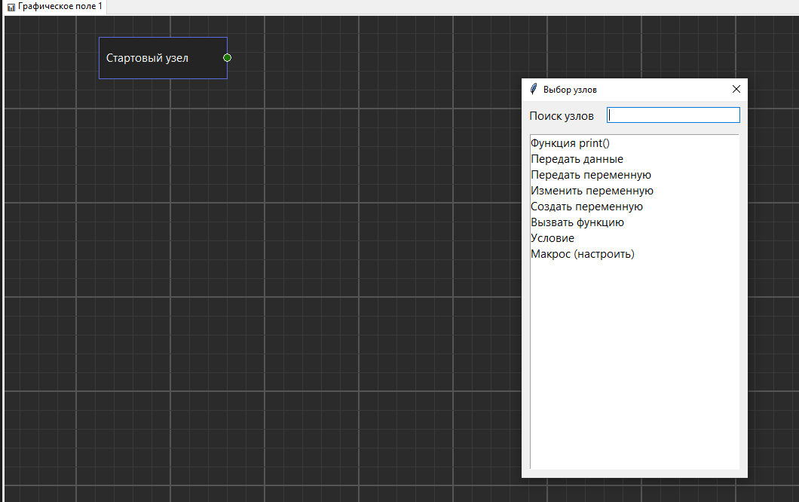

### Способ 2: Двойной клик

Дважды кликните на пустом месте холста — создастся узел по умолчанию.

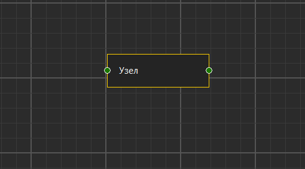

## Типы узлов

| Узел | Назначение | Параметры |
|------|------------|-----------|
| **Печатать на экран** | Вывод текста или переменной | Значение |
| **Передать данные** | Передача статического значения | Значение |
| **Передать переменную** | Передача ссылки на переменную | Переменная |
| **Создать переменную** | Создание новой переменной | Имя, Значение |
| **Изменить переменную** | Изменение существующей переменной | Переменная, Значение |
| **Обычный узел** | Базовый блок ||

## Создание связей

### Execution связь (поток выполнения)

1. Нажмите на **выходной порт** узла-источника (справа от узла)
2. Перетащите линию на **входной порт** узла-приёмника (слева от узла)
3. Отпустите

#### Назначение: Определяет порядок выполнения узлов.

Процесс создания связи

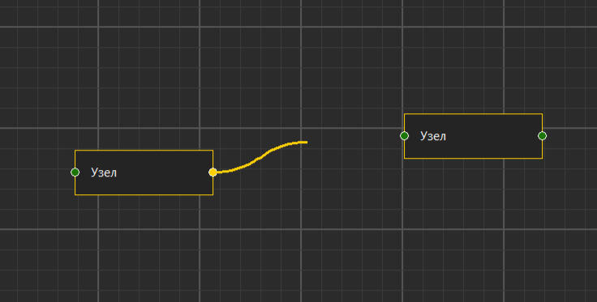

Конец создания связи

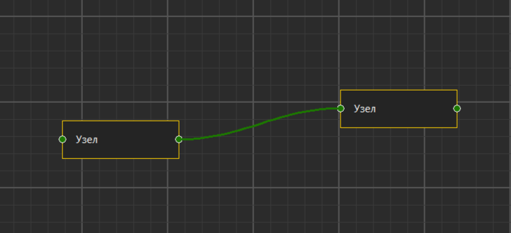

### Data связь (передача данных)

1. Нажмите на **выходной data-порт** (фиолетовый) узла-источника
2. Перетащите линию на **входной data-порт** (фиолетовый) узла-приёмника
3. Отпустите

#### Назначение: Передаёт данные из одного узла в другой.

В этом примере есть узел `Функция print()` которая выводит
на экран текст.
В её порт передачи данных мы привязали узел `Передать данные`
Теперь, узел `Функция print()` имеет то же значение что и `Передать данные`

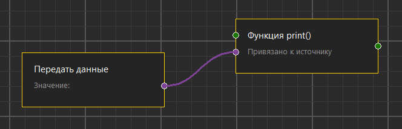

## Редактирование узлов

### Изменение имени

Дважды кликните по заголовку узла → введите новое имя → нажмите Enter

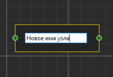

### Изменение параметров

1. Выделите узел (кликните по нему)
2. В правой панели **"Инспектор"** измените нужные поля
3. Нажмите Enter или кликните в другое место

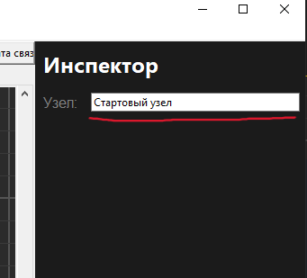

Изменения применяются автоматически

## Перемещение узлов

1. Зажмите **ЛКМ** на узле
2. Перетащите в нужное место
3. Отпустите

## Удаление

### Удаление узла

1. Нажмите ПКМ на узел который хотите удалить
2. В появившемся меню нажмите "Удалить узел"

**Примечание**: с удалением узла удаляются все его связи

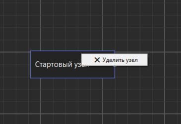

### Удаление связи

1. Нажмите **ПКМ** на линии связи
2. Выберите **"Удалить связь"**

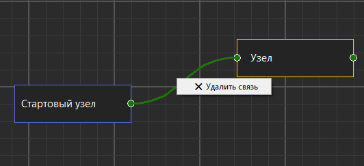

## Навигация

| Действие | Результат |
|----------|-----------|
| **Зажать среднюю кнопку мыши + движение** | Панорамирование поля |
| **Клик на полосу прокрутки** | Быстрая навигация по полю |

## Выполнение кода

### Запустить код

Что бы запустить код, нажмите кнопку "Compile and run"
в тулбаре и выйдет окно с результатом выполнения кода

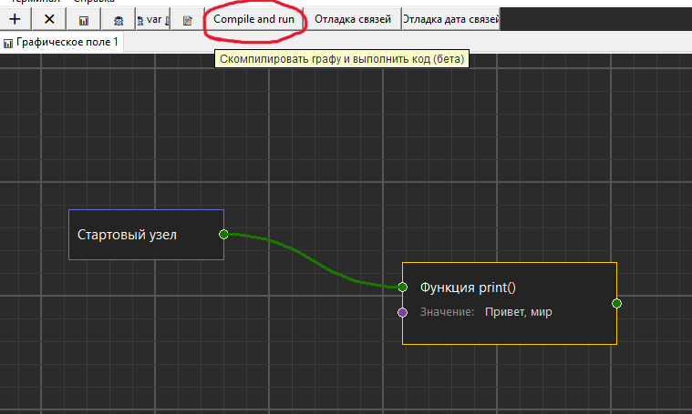

Окно выполнения кода:

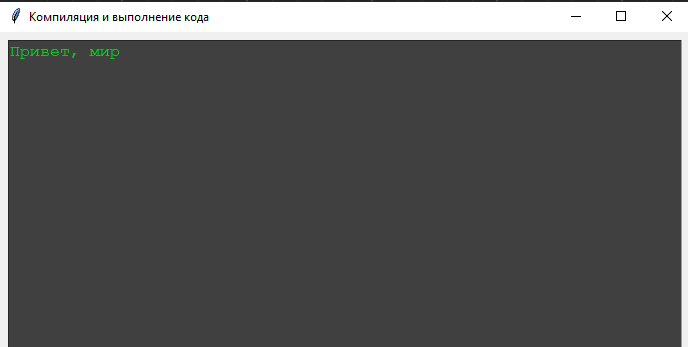
